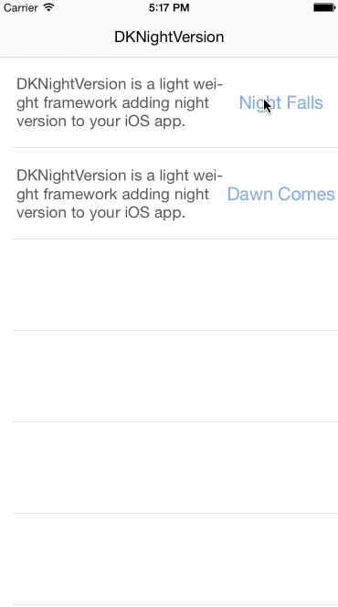

# DKNightVersion
DKNightVersion is a light weight framework. It's built through `objc/runtime` library, providing a neat approach  adding night version to your iOS app. A great many of code for this framework is generated by Ruby script.

The most delightful feature of DKNightVersion is that it appends one more property `nightColor` to frequently-used UIKit components. It is easily-used and well-designed. Hope you have a great joy to use DKNightVersion to integrate night mode in your Apps.


[](https://travis-ci.org/Draveness/DKNightVersion)

# Demo



# Installation with CocoaPods

[CocoaPods](https://cocoapods.org/) is a dependency manager for Objective-C, which automates and simplifies the process of using 3rd-party libraries like DKNightVersion in your projects. See the [Get Started section](https://cocoapods.org/#get_started) for more details.

## Podfile

```
pod "DKNightVersion", "~> 0.4.5"
```

## Usage

```
#import "DKNightVersion.h"
```

----

# How to use

API documentation is not available now.

## Using night color

This framework is based on a property `nightColor`, such as `nightBackgroundColor` `nightTextColor`...

Assign the night version color you want to the `UIKit` component:

```
self.view.nightBackgroundColor = [UIColor blackColor];
self.label.nightTextColor = [UIColor whiteColor];
```

## Using DKNightVersionManager change theme

Use `DKNightVersionManager` sets the theme.

```
[DKNightVersionManager nightFalling];
```

If you'd like to switch back to normal theme version:

```
[DKNightVersionManager dawnComing];
```

# Contact

- Powered by [Draveness](http://github.com/draveness)
- Personal website [DeltaX](http://deltax.me)

# License

DKNightVersion is available under the MIT license. See the LICENSE file for more info.

# Todo

- Add more color support
- Test
- Documentation

## Using property table generate color

**Not recommend use property table for production, this ruby sciprt is just for developing.**

`property_table.yaml` is a file which saves the night color you need, if the exising colors is not enough for you, add the `class` and `property` in it.

```
UIView:
  properties:
  - backgroundColor:
      defaultColor: "0x343434"
  - tintColor:
      defaultColor: "0xffffff"
UILabel:
  superklass: UIView
  properties:
  - textColor:
      defaultColor: "0x5d5d5d"
UINavigationBar:
  superklass: UIView
  properties:
  - barTintColor:
      defaultColor: "0x444444"
  - tintColor:
      defaultColor: "0xffffff"
UIButton:
  superklass: UIView
  properties:
  - titleColor:
      defaultColor: "0xb9b9b9"
      getter: currentTitleColor
      setter: setTitleColor:(UIColor*)titleColor forState:(UIControlState)state
      parameter: UIControlStateNormal
UIScrollView:
  superklass: UIView
  properties:
  - backgroundColor:
      defaultColor: "0x343434"
UITableView:
  superklass: UIScrollView
  properties:
  - backgroundColor:
      defaultColor: "0x343434"
  - separatorColor:
      defaultColor: "0x313131"
```

Notice the superclass property is needed if it has a superclass.

```
ruby generator.rb
```

Run this command in `Classes/Generator` folder, this will dynamically generate Objective-C code in `Classes/UIKit` folder. 

And drag files generated just now in your workspace.
